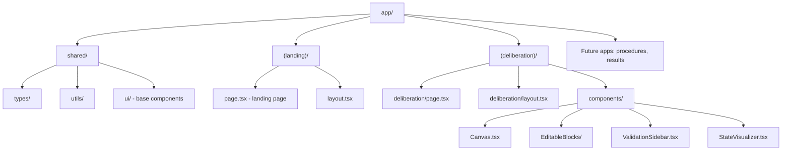
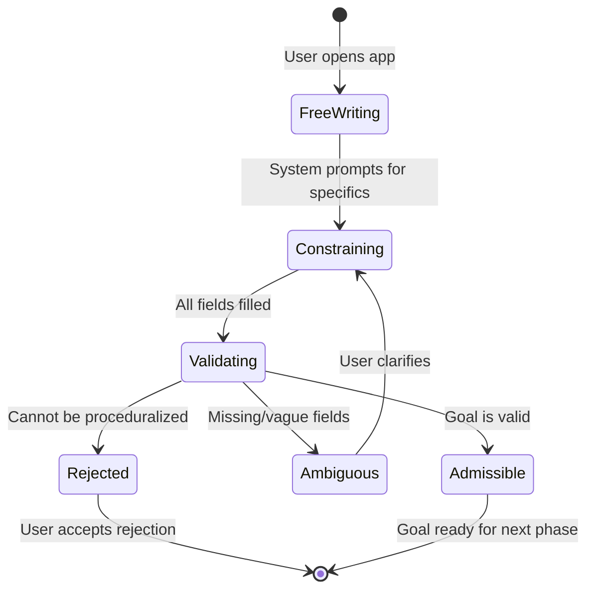

# Deliberation App - Frontend Architecture & Implementation

## Architecture Overview




## 1. Project Structure

Create new Next.js app in [`app/`](app/) folder:

```javascript
app/
├── package.json                    # New Next.js project
├── tsconfig.json
├── next.config.ts
├── tailwind.config.ts
├── src/
│   ├── app/
│   │   ├── layout.tsx              # Root layout
│   │   ├── globals.css             # B&W design system
│   │   ├── (landing)/              # Route group for landing
│   │   │   ├── page.tsx            # Home page
│   │   │   └── layout.tsx
│   │   └── deliberation/           # Deliberation app route
│   │       ├── page.tsx
│   │       ├── layout.tsx
│   │       └── components/         # Deliberation-specific components
│   │           ├── Canvas.tsx
│   │           ├── EditableBlock.tsx
│   │           ├── IntentionBlock.tsx
│   │           ├── ObservableBlock.tsx
│   │           ├── VerificationBlock.tsx
│   │           ├── TimeHorizonBlock.tsx
│   │           ├── ReversibilityBlock.tsx
│   │           ├── ResourceConstraintsBlock.tsx
│   │           ├── ValidationSidebar.tsx
│   │           └── StateVisualizer.tsx
│   └── shared/                      # Shared across apps
│       ├── types/
│       │   ├── goal.ts              # Goal type definition
│       │   └── validation.ts        # Validation types
│       ├── utils/
│       │   ├── validation.ts        # Goal validation logic
│       │   └── formatting.ts
│       └── ui/                      # Shared base components
│           ├── Typography.tsx
│           └── Container.tsx
```


## 2. Core Type System

**[`app/src/shared/types/goal.ts`](app/src/shared/types/goal.ts)**Define the Goal type exactly as specified:

```typescript
export type Goal = {
  description: string;
  observable_return: string;
  external_verification: string | null;
  time_horizon_days: number;
  reversibility: boolean;
  resource_constraints: {
    time: number;
    energy: number;
    attention: number;
  };
};

export type GoalValidationState = 
  | { status: 'admissible'; goal: Goal }
  | { status: 'ambiguous'; missing: string[]; reasons: string[] }
  | { status: 'rejected'; reasons: string[] };
```


## 3. Validation Logic

**[`app/src/shared/utils/validation.ts`](app/src/shared/utils/validation.ts)**Implement validation rules:

- Check all required fields are present and non-empty
- Validate observable_return is specific and measurable
- Ensure external_verification is either clear or explicitly null
- Time horizon must be realistic (> 0)
- Resource constraints must sum reasonably

Return clear reasons for ambiguity or rejection.

## 4. UI Components

### Canvas Component

**[`app/src/app/deliberation/components/Canvas.tsx`](app/src/app/deliberation/components/Canvas.tsx)**

- Full-page editable surface
- Manages state of all blocks
- Coordinates validation
- No traditional "form" - progressive disclosure of constraints

### Editable Blocks

Each block type (Intention, Observable, Verification, etc.) is a controlled component that:

- Starts open-ended (textarea-like)
- Shows contextual prompts when focused
- Displays validation feedback inline
- Explains WHY each field matters

**Key blocks:**

- **IntentionBlock**: Free-form initial input
- **ObservableBlock**: Forces specificity - "What changes in reality?"
- **VerificationBlock**: "Who/what can verify this externally?"
- **TimeHorizonBlock**: Numeric input with realistic bounds
- **ReversibilityBlock**: Binary choice with explanation
- **ResourceConstraintsBlock**: Sliders or numeric inputs for time/energy/attention

### Validation Sidebar

**[`app/src/app/deliberation/components/ValidationSidebar.tsx`](app/src/app/deliberation/components/ValidationSidebar.tsx)**Fixed sidebar showing:

- Current validation state (Admissible / Ambiguous / Rejected)
- Missing fields list
- Reasons for current state
- No action buttons - just status display

### State Visualizer (Optional Enhancement)

Shows dependency graph or goal structure visually once admissible.

## 5. Design System

**[`app/src/app/globals.css`](app/src/app/globals.css)**Black & white only:

- Typography: System fonts, clear hierarchy
- Spacing: Generous whitespace
- No animations, transitions
- High contrast
- Focus on readability

Colors:

- Background: `#FFFFFF`
- Text: `#000000`
- Borders: `#E5E5E5`
- Focus states: `#000000` with border
- Disabled: `#999999`

Typography scale:

- Body: 16px
- Headings: 24px, 20px, 18px
- Monospace for code/structured data

## 6. State Management

Use React Context or simple useState at Canvas level:

- No external state library needed (Zustand/Redux)
- Local state for goal construction
- Validation runs on every field change
- Clear, synchronous state flow

## 7. User Flow




1. User lands on blank canvas
2. Types initial intention freely
3. System introduces one constraint at a time
4. Each constraint explained clearly
5. Validation state updates in real-time
6. Rejection is neutral, not negative
7. Admissible goal shows complete structure

## 8. Key Implementation Details

**No "Create Goal" button**: The canvas IS the goal. State builds progressively.**Rejection is first-class**: If a goal can't be externally verified or decomposed, the UI says so clearly without shame.**Constraints are educational**: Each prompt explains the "why" - "A goal needs external verification because..."**Minimal state**: Only store what's needed for validation. No user profiles, no persistence initially.

## 9. Future-Proofing for Other Apps

Keep deliberation logic isolated:

- Other apps (procedures, results) will have their own routes
- Shared types in [`app/src/shared/types/`](app/src/shared/types/)
- Goal type will be imported by procedure execution app
- Clean boundaries between apps

## 10. Development Priority

1. **Setup**: Initialize Next.js, configure TypeScript, Tailwind
2. **Types**: Define Goal and validation types
3. **Validation**: Implement core validation logic