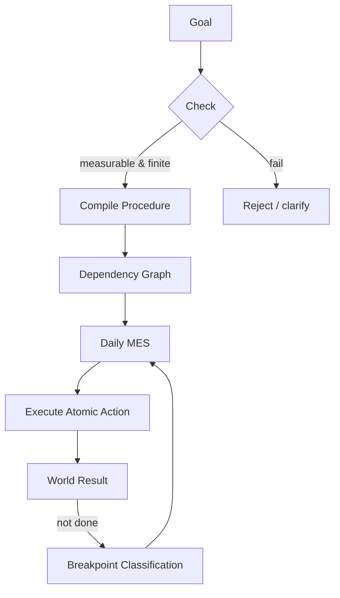

Chance — система исполнения целей

Минимум слов, максимум процедур. Цель — кандидат на исполнение или шум.

## Карта процесса


## Формальные сущности
- `A` — атомарное действие: одна сессия, бинарный результат, не требует доп. мышления.
- `P = (A₁..Aₙ)` — процедура: входные предусловия, выходные постусловия, контракт "выполнено → достигнуто".
- `MES` — минимальный исполнимый шаг сегодня: самое приоритетное `A` с выполненными предусловиями.

### Инварианты
- Цель измерима и конечна.
- Граф зависимостей без циклов.
- Все предусловия контролируются агентом.
- В каждый момент существует либо `MES`, либо явно зафиксированный блокер.

### Следствия
- Ежедневное выполнение `MES` → `lim(t→∞) progress(G,t) = 1`.
- Любая пауза — указание на конкретный тип брейкпоинта.
- Неатомарные формулировки немедленно отвергаются/декомпозируются.

## Диагностика отказов
```mermaid
flowchart LR
    Start --> Classify{Breakpoint?}
    Classify -->|Time| T[duration(A) > available_time]
    Classify -->|Energy| E1[required_energy(A) > current_energy]
    Classify -->|Clarity| C1[Action not atomic]
    Classify -->|External| X[Waiting for uncontrollable precondition]
    T --> FixTime[Re-scope / schedule]
    E1 --> FixEnergy[Restore energy / swap action]
    C1 --> Decompose[Make it atomic]
    X --> RemoveBlocker[Change dependency or wait intentionally]
    FixTime --> MES
    FixEnergy --> MES
    Decompose --> MES
    RemoveBlocker --> MES
```

## Паразитные процедуры
`utility_long_term(P) < 0` → память/время течёт; помечаем и устраняем в графе зависимостей.

## Интерфейсы системы
- `landing/` — концепт.
- `app/` — компилятор целей, исполнение процедур (граф зависимостей, Trello/Task менеджеры), возврат фактических результатов.
- Архитектура: `docs/products/architecture`.

## Быстрые проверки перед запуском
- Цель сформулирована метрикой и конечным состоянием.
- Разложена на `A`; нет циклов.
- Известен `MES` на сегодня; блокеры задокументированы.

## Документация
- `docs/core/math.md` — формализация.
- `docs/core/dependency-measure.md` — метрика зависимости.
- `docs/core/parasitic-goals.md` — детекция утечек.
- `docs/core/axioms.md` — аксиоматика.

*Целей нет. Есть процедуры.*

